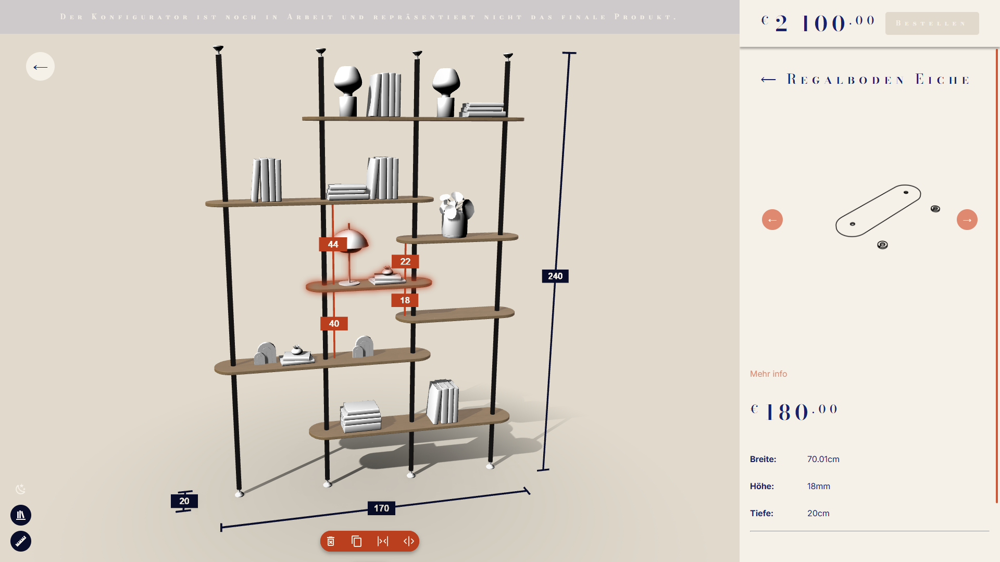

# Shelf furniture configurator #

A web-based 3D configurator for modular shelf systems that I built and tried to turn into a product. Inspired by IKEA's PAX 3D configurator. Built using **TypeScript**, **Babylon.js**. Allows users to design a custom version in terms of dimensions and layout in real-time 3D.

# Demo #
Its definetly still a WiP and there might be some bugs but feel free to try it out and break it.
### [https://www.serenepieces.com/configurator](https://www.serenepieces.com/configurator) ###